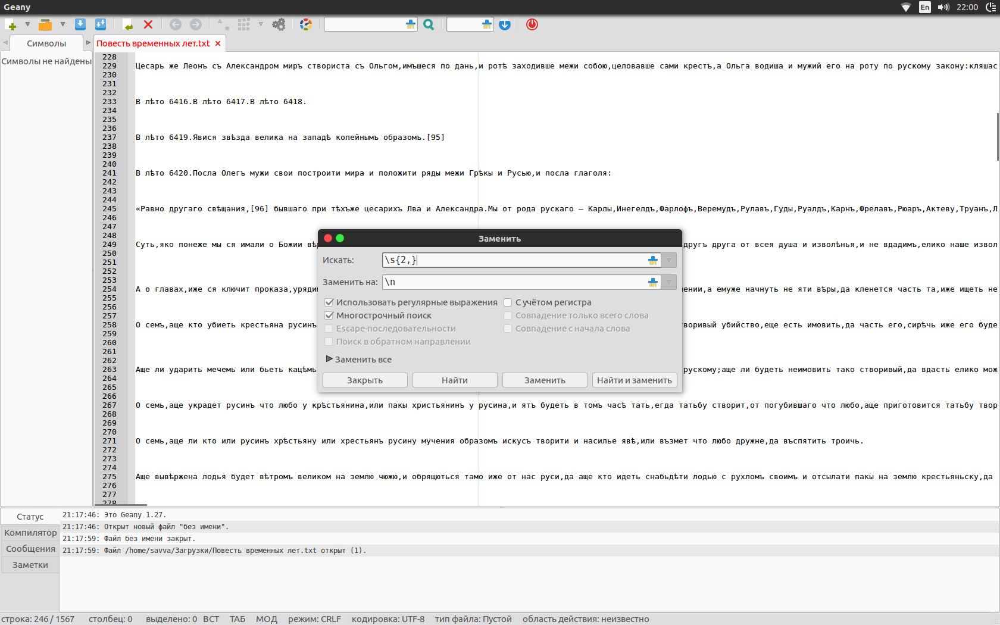
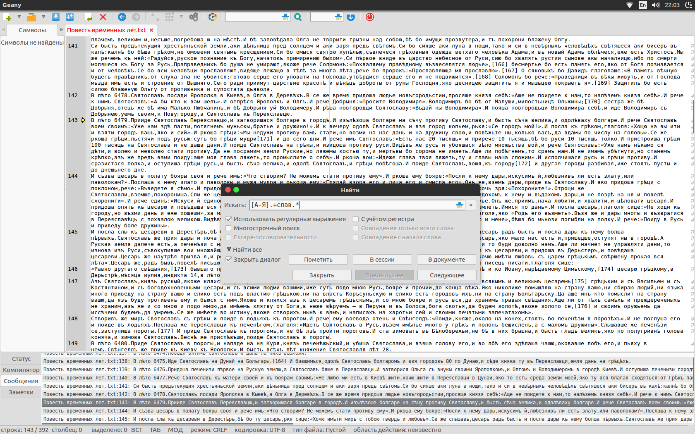
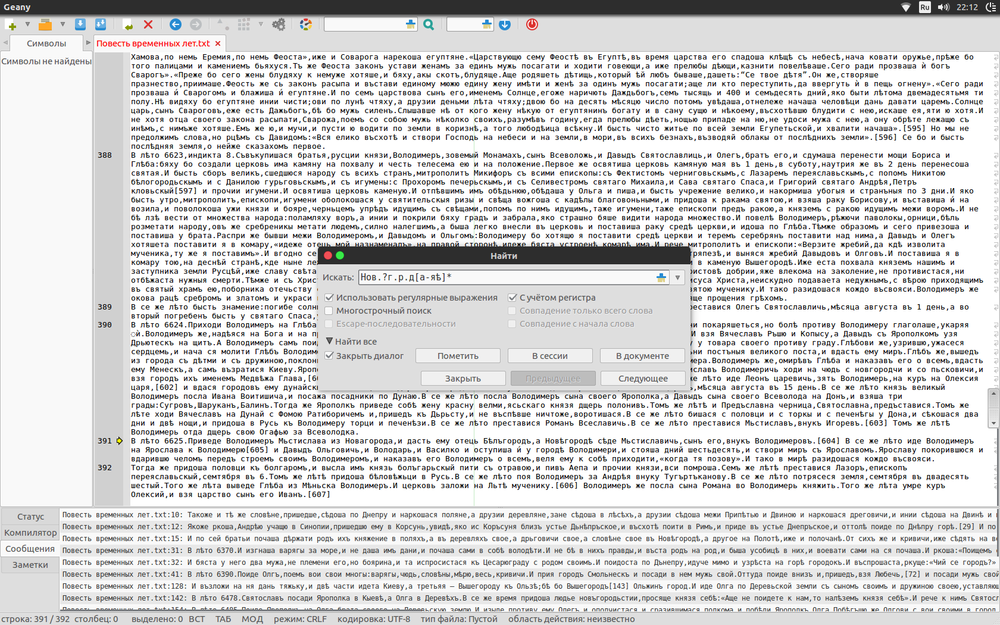
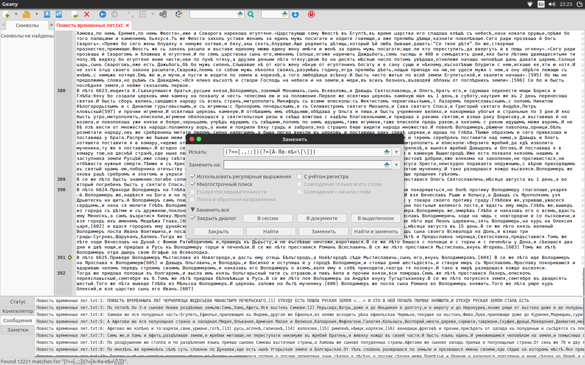

# hw9

1. Использовала регулярное выражение: `\s{2,}`.
   Заменила все вхождения на `" "`.
   Всего пустых строк: 391.

2. Использовала регулярное выражение: `[А-Я].+слав.*`
   Всего упоминаний о князьях найдено: 177

3. Использовала регулярное выражение: `Нов.?г.р.д[а-яѣ]*`
   Всего упоминаний Новгорода найдено: 59

4. Бонусное задание:
   Я использовала такое регулярное выражение: `(?<=[.,:;])(?=[А-Яа-яѣ«\[\]])` и заменила совпадения пробелами.

